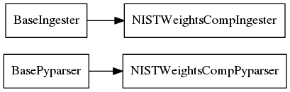

.. _api:

API Reference
=================

carsus.io.base Module
-----------------------

.. module:: io.base

This module defines base classes for parsers and ingesters.

Members
~~~~~~~~

.. autoclass:: carsus.io.base.BaseParser

.. autoclass:: carsus.io.base.BasePyparser

.. autoclass:: carsus.io.base.BaseIngester

Class inheritance diagram
~~~~~~~~~~~~~~~~~~~~~~~~~~~

.. image:: ../images/io_base_inheritance.png
    :width: 300

carsus.io.nist Package
-------------------------

.. module:: io.base

This package defines parsers and ingesters for the NIST databases.

Members
~~~~~~~~

.. autofunction:: carsus.io.nist.download_weightscomp

.. autoclass:: carsus.io.nist.NISTWeightsCompPyparser(grammar=isotope, columns=COLUMNS, input_data=None)

.. autoclass:: carsus.io.nist.NISTWeightsCompIngester(parser_cls=NISTWeightsCompPyparser, downloader=download_weightscomp)

Class inheritance diagram
~~~~~~~~~~~~~~~~~~~~~~~~~~~

